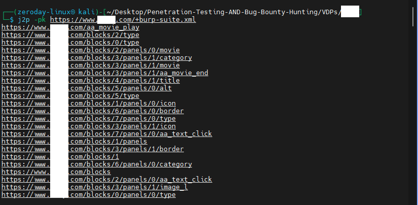

# 🐞 Bug Bounty Hunter Mindset v1.0

---

## 📌 Introduction

This project contains useful ideas and tools for bug bounty hunting.  
It’s created for my own use but shared publicly so others can benefit too.

---

## 🛠️ Creating Custom Wordlists for Bug Bounty Targets: A Complete Guide

### 🔹 Step 1: Generating a Company-Specific Wordlist

- **Extracting in-page keywords**

  - **Command:**
    ```bash
    cewl https://example.com --header "Cookie: PHPSESSID=7a9b4c2d8e3f1g5h6i7j8k9l0m1n2o3p" -d 5 -m 4
    ```
  - **Tool:** [CeWL - GitHub Repository](https://github.com/digininja/CeWL)

- **Extracting URL keywords**

  - **Command:**
    ```bash
    cat /path/to/urls.txt | tok
    ```
  - **Tool:** [tok by tomnomnom - GitHub](https://github.com/tomnomnom/hacks/tree/master/tok)

- **Extracting keywords from JavaScript files**
  - **Command:**
    ```bash
    cat /path/to/js-urls.txt | python3 getjswords.py
    ```
  - **Tool:** [getjswords.py - GitHub (BBTz by m4ll0k)](https://github.com/m4ll0k/BBTz/blob/master/getjswords.py)

### 🔹 Step 2: Crafting a Technology-Specific Wordlist

- Use wordlists from **SecLists**:  
  🔗 [SecLists - GitHub Repository](https://github.com/danielmiessler/SecLists)

### 🔹 Step 3: Including Commonly Occurring Keywords

- Use the file `all.txt` from **JHaddix**:  
  🔗 [JHaddix's all.txt - Gist](https://gist.github.com/jhaddix/86a06c5dc309d08580a018c66354a056)

### 🔹 Step 4: Combining All Lists

- Combine all wordlists into one final file:
  ```bash
  cat list1.txt list2.txt list3.txt > all_word-lists.txt
  ```

---

### 🔍 json2paths

This tool finds hidden endpoints, especially on APIs. It fetches JSON responses from BurpSuite history and creates url-paths wordlist from JSON keys.


Installation:

```bash
pip3 install json2paths
```

**📤 Exporting BurpSuite History:**

To export responses from BurpSuite:

1. Select the responses you want **or select all responses**.
2. Right-click the selection.
3. Choose **"Save items..."** from the context menu.
4. In the dialog, make sure **Base64 encoding is disabled**.

### 🚀 **Usage**

Run the tool on your exported history file to generate a wordlist of API paths from JSON keys.
For more details... try it out and explore! 😉

```bash
Usage: j2p <options> <prefix>+<path to burp-file>

Available options:
  p: print paths
  k: print keys

<prefix>+ and <options> are optional.

Examples:
  > j2p -p test.txt
  > j2p -pk /+test.txt
```

---

## **Note: I will keep it updated always (Insha'Allah) 😊✨**

---

## **🧑‍💻 Author & Socials**

You can follow and connect with me through the following link:
[All Links:](https://linktr.ee/1ZeroDay) 🌐.

---

## 📄 License

This project is licensed under the  
[Creative Commons Attribution 4.0 International (CC BY 4.0) License](https://creativecommons.org/licenses/by/4.0/).
